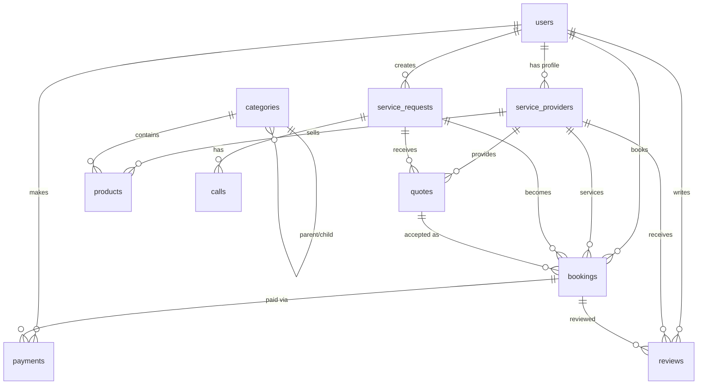

# 🗄️ Database Schema Documentation

This document provides a comprehensive overview of the Fixer Marketplace database schema, including table structures, relationships, and usage patterns.

## 📊 Database Overview

- **Database**: PostgreSQL 14+
- **Encoding**: UTF-8
- **Timezone**: UTC
- **Extensions**: uuid-ossp, pgcrypto
- **Connection Pool**: 20 max connections

## 🏗️ Core Tables

### 👥 Users Table

**Purpose**: Stores all user accounts (customers, providers, admins)

```sql
CREATE TABLE users (
  id UUID PRIMARY KEY DEFAULT gen_random_uuid(),
  email VARCHAR(255) UNIQUE NOT NULL,
  phone VARCHAR(20) UNIQUE NOT NULL,
  password_hash VARCHAR(255) NOT NULL,
  user_type VARCHAR(20) NOT NULL CHECK (user_type IN ('customer', 'provider', 'admin', 'super_admin')),
  first_name VARCHAR(100) NOT NULL,
  last_name VARCHAR(100) NOT NULL,
  profile_picture TEXT,
  is_verified BOOLEAN DEFAULT FALSE,
  created_at TIMESTAMP DEFAULT NOW(),
  updated_at TIMESTAMP DEFAULT NOW()
);

-- Indexes
CREATE INDEX idx_users_email ON users(email);
CREATE INDEX idx_users_phone ON users(phone);
CREATE INDEX idx_users_user_type ON users(user_type);
CREATE INDEX idx_users_created_at ON users(created_at);
```

**Usage Patterns**:
- Primary table for all user authentication
- Referenced by all other user-related tables
- Supports multiple user types with RBAC
- Email and phone are unique identifiers

### 🏢 Service Providers Table

**Purpose**: Extended profile information for service providers

```sql
CREATE TABLE service_providers (
  id UUID PRIMARY KEY DEFAULT gen_random_uuid(),
  user_id UUID REFERENCES users(id) ON DELETE CASCADE,
  business_name VARCHAR(255) NOT NULL,
  business_license VARCHAR(100),
  services_offered TEXT[],
  service_areas TEXT[],
  verification_status VARCHAR(20) DEFAULT 'pending' CHECK (verification_status IN ('pending', 'verified', 'rejected')),
  rating DECIMAL(3,2) DEFAULT 0.00 CHECK (rating >= 0 AND rating <= 5),
  total_reviews INTEGER DEFAULT 0,
  years_experience INTEGER DEFAULT 0,
  bio TEXT,
  created_at TIMESTAMP DEFAULT NOW(),
  updated_at TIMESTAMP DEFAULT NOW()
);

-- Indexes
CREATE INDEX idx_service_providers_user_id ON service_providers(user_id);
CREATE INDEX idx_service_providers_verification_status ON service_providers(verification_status);
CREATE INDEX idx_service_providers_rating ON service_providers(rating);
CREATE INDEX idx_service_providers_services ON service_providers USING GIN(services_offered);
```

**Usage Patterns**:
- One-to-one relationship with users table
- Stores business-specific information
- Supports array fields for services and areas
- Includes rating and review system

### 🛠️ Service Requests Table

**Purpose**: Customer service requests and requirements

```sql
CREATE TABLE service_requests (
  id UUID PRIMARY KEY DEFAULT gen_random_uuid(),
  customer_id UUID REFERENCES users(id) ON DELETE CASCADE,
  service_type VARCHAR(100) NOT NULL,
  title VARCHAR(255) NOT NULL,
  description TEXT NOT NULL,
  location JSONB NOT NULL,
  urgency VARCHAR(20) DEFAULT 'medium' CHECK (urgency IN ('low', 'medium', 'high', 'emergency')),
  status VARCHAR(20) DEFAULT 'open' CHECK (status IN ('open', 'quoted', 'booked', 'in_progress', 'completed', 'cancelled')),
  budget_min DECIMAL(10,2),
  budget_max DECIMAL(10,2),
  preferred_date DATE,
  preferred_time TIME,
  images TEXT[],
  created_at TIMESTAMP DEFAULT NOW(),
  updated_at TIMESTAMP DEFAULT NOW()
);

-- Indexes
CREATE INDEX idx_service_requests_customer_id ON service_requests(customer_id);
CREATE INDEX idx_service_requests_service_type ON service_requests(service_type);
CREATE INDEX idx_service_requests_status ON service_requests(status);
CREATE INDEX idx_service_requests_urgency ON service_requests(urgency);
CREATE INDEX idx_service_requests_created_at ON service_requests(created_at);
CREATE INDEX idx_service_requests_location ON service_requests USING GIN(location);
```

**Location JSONB Structure**:
```json
{
  "address": "123 Main St, City, State",
  "city": "City Name",
  "state": "State Name",
  "zip_code": "12345",
  "coordinates": {
    "lat": 40.7128,
    "lng": -74.0060
  }
}
```

### 💰 Quotes Table

**Purpose**: Service provider quotes for service requests

```sql
CREATE TABLE quotes (
  id UUID PRIMARY KEY DEFAULT gen_random_uuid(),
  service_request_id UUID REFERENCES service_requests(id) ON DELETE CASCADE,
  provider_id UUID REFERENCES service_providers(id) ON DELETE CASCADE,
  amount DECIMAL(10,2) NOT NULL CHECK (amount > 0),
  description TEXT,
  estimated_duration INTEGER, -- in minutes
  status VARCHAR(20) DEFAULT 'pending' CHECK (status IN ('pending', 'accepted', 'rejected', 'expired')),
  valid_until TIMESTAMP,
  created_at TIMESTAMP DEFAULT NOW(),
  updated_at TIMESTAMP DEFAULT NOW()
);

-- Indexes
CREATE INDEX idx_quotes_service_request_id ON quotes(service_request_id);
CREATE INDEX idx_quotes_provider_id ON quotes(provider_id);
CREATE INDEX idx_quotes_status ON quotes(status);
CREATE INDEX idx_quotes_amount ON quotes(amount);
CREATE INDEX idx_quotes_created_at ON quotes(created_at);
```

### 📅 Bookings Table

**Purpose**: Scheduled service appointments

```sql
CREATE TABLE bookings (
  id UUID PRIMARY KEY DEFAULT gen_random_uuid(),
  service_request_id UUID REFERENCES service_requests(id) ON DELETE CASCADE,
  quote_id UUID REFERENCES quotes(id) ON DELETE CASCADE,
  customer_id UUID REFERENCES users(id) ON DELETE CASCADE,
  provider_id UUID REFERENCES service_providers(id) ON DELETE CASCADE,
  scheduled_date DATE NOT NULL,
  scheduled_time TIME NOT NULL,
  duration INTEGER NOT NULL, -- in minutes
  total_amount DECIMAL(10,2) NOT NULL,
  status VARCHAR(20) DEFAULT 'scheduled' CHECK (status IN ('scheduled', 'in_progress', 'completed', 'cancelled', 'no_show')),
  notes TEXT,
  created_at TIMESTAMP DEFAULT NOW(),
  updated_at TIMESTAMP DEFAULT NOW()
);

-- Indexes
CREATE INDEX idx_bookings_customer_id ON bookings(customer_id);
CREATE INDEX idx_bookings_provider_id ON bookings(provider_id);
CREATE INDEX idx_bookings_status ON bookings(status);
CREATE INDEX idx_bookings_scheduled_date ON bookings(scheduled_date);
CREATE INDEX idx_bookings_created_at ON bookings(created_at);
```

### 💳 Payments Table

**Purpose**: Payment transactions and records

```sql
CREATE TABLE payments (
  id UUID PRIMARY KEY DEFAULT gen_random_uuid(),
  booking_id UUID REFERENCES bookings(id) ON DELETE CASCADE,
  customer_id UUID REFERENCES users(id) ON DELETE CASCADE,
  provider_id UUID REFERENCES service_providers(id) ON DELETE CASCADE,
  amount DECIMAL(10,2) NOT NULL,
  currency VARCHAR(3) DEFAULT 'USD',
  payment_method VARCHAR(50) NOT NULL,
  payment_provider VARCHAR(50) NOT NULL, -- 'stripe', 'razorpay'
  provider_transaction_id VARCHAR(255),
  status VARCHAR(20) NOT NULL CHECK (status IN ('pending', 'completed', 'failed', 'refunded', 'cancelled')),
  metadata JSONB,
  created_at TIMESTAMP DEFAULT NOW(),
  updated_at TIMESTAMP DEFAULT NOW()
);

-- Indexes
CREATE INDEX idx_payments_booking_id ON payments(booking_id);
CREATE INDEX idx_payments_customer_id ON payments(customer_id);
CREATE INDEX idx_payments_provider_id ON payments(provider_id);
CREATE INDEX idx_payments_status ON payments(status);
CREATE INDEX idx_payments_provider_transaction_id ON payments(provider_transaction_id);
```

### 📞 Calls Table

**Purpose**: Video/voice call records

```sql
CREATE TABLE calls (
  id UUID PRIMARY KEY DEFAULT gen_random_uuid(),
  customer_id UUID REFERENCES users(id) ON DELETE CASCADE,
  provider_id UUID REFERENCES service_providers(id) ON DELETE CASCADE,
  service_request_id UUID REFERENCES service_requests(id) ON DELETE SET NULL,
  call_type VARCHAR(10) NOT NULL CHECK (call_type IN ('voice', 'video')),
  status VARCHAR(20) NOT NULL CHECK (status IN ('scheduled', 'in_progress', 'completed', 'failed', 'cancelled')),
  call_duration INTEGER, -- in seconds
  call_recording_url TEXT,
  notes TEXT,
  created_at TIMESTAMP DEFAULT NOW(),
  updated_at TIMESTAMP DEFAULT NOW()
);

-- Indexes
CREATE INDEX idx_calls_customer_id ON calls(customer_id);
CREATE INDEX idx_calls_provider_id ON calls(provider_id);
CREATE INDEX idx_calls_status ON calls(status);
CREATE INDEX idx_calls_created_at ON calls(created_at);
```

### ⭐ Reviews Table

**Purpose**: Customer reviews and ratings

```sql
CREATE TABLE reviews (
  id UUID PRIMARY KEY DEFAULT gen_random_uuid(),
  booking_id UUID REFERENCES bookings(id) ON DELETE CASCADE,
  customer_id UUID REFERENCES users(id) ON DELETE CASCADE,
  provider_id UUID REFERENCES service_providers(id) ON DELETE CASCADE,
  rating INTEGER NOT NULL CHECK (rating >= 1 AND rating <= 5),
  comment TEXT,
  is_verified BOOLEAN DEFAULT FALSE,
  created_at TIMESTAMP DEFAULT NOW(),
  updated_at TIMESTAMP DEFAULT NOW()
);

-- Indexes
CREATE INDEX idx_reviews_booking_id ON reviews(booking_id);
CREATE INDEX idx_reviews_customer_id ON reviews(customer_id);
CREATE INDEX idx_reviews_provider_id ON reviews(provider_id);
CREATE INDEX idx_reviews_rating ON reviews(rating);
```

### 📦 Products Table

**Purpose**: Product catalog for e-commerce features

```sql
CREATE TABLE products (
  id UUID PRIMARY KEY DEFAULT gen_random_uuid(),
  name VARCHAR(255) NOT NULL,
  description TEXT,
  sku VARCHAR(100) UNIQUE,
  category_id UUID REFERENCES categories(id) ON DELETE SET NULL,
  provider_id UUID REFERENCES service_providers(id) ON DELETE CASCADE,
  price DECIMAL(10,2) NOT NULL CHECK (price >= 0),
  stock_quantity INTEGER DEFAULT 0 CHECK (stock_quantity >= 0),
  status VARCHAR(20) DEFAULT 'active' CHECK (status IN ('active', 'inactive', 'discontinued')),
  is_featured BOOLEAN DEFAULT FALSE,
  images TEXT[],
  specifications JSONB,
  created_at TIMESTAMP DEFAULT NOW(),
  updated_at TIMESTAMP DEFAULT NOW()
);

-- Indexes
CREATE INDEX idx_products_category_id ON products(category_id);
CREATE INDEX idx_products_provider_id ON products(provider_id);
CREATE INDEX idx_products_status ON products(status);
CREATE INDEX idx_products_price ON products(price);
CREATE INDEX idx_products_sku ON products(sku);
```

### 🏷️ Categories Table

**Purpose**: Product and service categories

```sql
CREATE TABLE categories (
  id UUID PRIMARY KEY DEFAULT gen_random_uuid(),
  name VARCHAR(255) NOT NULL,
  description TEXT,
  parent_id UUID REFERENCES categories(id) ON DELETE CASCADE,
  status VARCHAR(20) DEFAULT 'active' CHECK (status IN ('active', 'inactive')),
  created_at TIMESTAMP DEFAULT NOW(),
  updated_at TIMESTAMP DEFAULT NOW()
);

-- Indexes
CREATE INDEX idx_categories_parent_id ON categories(parent_id);
CREATE INDEX idx_categories_status ON categories(status);
CREATE INDEX idx_categories_name ON categories(name);
```

## 🔐 RBAC Tables

### 👤 Roles Table

**Purpose**: User roles for access control

```sql
CREATE TABLE roles (
  id UUID PRIMARY KEY DEFAULT gen_random_uuid(),
  name VARCHAR(50) UNIQUE NOT NULL,
  description TEXT,
  permissions UUID[],
  is_active BOOLEAN DEFAULT TRUE,
  created_at TIMESTAMP DEFAULT NOW(),
  updated_at TIMESTAMP DEFAULT NOW()
);
```

### 🔑 Permissions Table

**Purpose**: System permissions

```sql
CREATE TABLE permissions (
  id UUID PRIMARY KEY DEFAULT gen_random_uuid(),
  name VARCHAR(100) UNIQUE NOT NULL,
  resource VARCHAR(50) NOT NULL,
  action VARCHAR(50) NOT NULL,
  conditions JSONB,
  is_active BOOLEAN DEFAULT TRUE,
  created_at TIMESTAMP DEFAULT NOW(),
  updated_at TIMESTAMP DEFAULT NOW()
);
```

### 🔗 User Roles Table

**Purpose**: Many-to-many relationship between users and roles

```sql
CREATE TABLE user_roles (
  id UUID PRIMARY KEY DEFAULT gen_random_uuid(),
  user_id UUID REFERENCES users(id) ON DELETE CASCADE,
  role_id UUID REFERENCES roles(id) ON DELETE CASCADE,
  assigned_by UUID REFERENCES users(id) ON DELETE SET NULL,
  created_at TIMESTAMP DEFAULT NOW(),
  UNIQUE(user_id, role_id)
);
```

## 📊 Analytics Tables

### 📈 Service Statistics Table

**Purpose**: Aggregated service statistics

```sql
CREATE TABLE service_statistics (
  id UUID PRIMARY KEY DEFAULT gen_random_uuid(),
  service_type VARCHAR(100) NOT NULL,
  total_requests INTEGER DEFAULT 0,
  completed_requests INTEGER DEFAULT 0,
  average_rating DECIMAL(3,2) DEFAULT 0.00,
  total_revenue DECIMAL(12,2) DEFAULT 0.00,
  date DATE NOT NULL,
  created_at TIMESTAMP DEFAULT NOW(),
  updated_at TIMESTAMP DEFAULT NOW(),
  UNIQUE(service_type, date)
);
```

## 🔄 Audit Tables

### 📝 Audit Logs Table

**Purpose**: Track all data changes for compliance

```sql
CREATE TABLE audit_logs (
  id UUID PRIMARY KEY DEFAULT gen_random_uuid(),
  table_name VARCHAR(100) NOT NULL,
  record_id UUID NOT NULL,
  action VARCHAR(20) NOT NULL CHECK (action IN ('INSERT', 'UPDATE', 'DELETE')),
  old_values JSONB,
  new_values JSONB,
  user_id UUID REFERENCES users(id) ON DELETE SET NULL,
  ip_address INET,
  user_agent TEXT,
  created_at TIMESTAMP DEFAULT NOW()
);

-- Indexes
CREATE INDEX idx_audit_logs_table_name ON audit_logs(table_name);
CREATE INDEX idx_audit_logs_record_id ON audit_logs(record_id);
CREATE INDEX idx_audit_logs_user_id ON audit_logs(user_id);
CREATE INDEX idx_audit_logs_created_at ON audit_logs(created_at);
```

## 🔗 Table Relationships

### Primary Relationships



## 📊 Database Performance

### Indexing Strategy

1. **Primary Keys**: All tables use UUID primary keys
2. **Foreign Keys**: Indexed for join performance
3. **Search Fields**: Email, phone, names indexed
4. **Status Fields**: Frequently queried status columns indexed
5. **Date Fields**: Created/updated timestamps indexed
6. **JSONB Fields**: GIN indexes for JSON queries

### Query Optimization

1. **Connection Pooling**: 20 max connections
2. **Query Caching**: Redis for frequently accessed data
3. **Read Replicas**: For read-heavy operations
4. **Partitioning**: Large tables partitioned by date

### Data Retention

1. **Audit Logs**: 7 years retention
2. **User Data**: Indefinite (GDPR compliant)
3. **Session Data**: 30 days
4. **Log Files**: 90 days

## 🔒 Security Considerations

### Data Protection

1. **Encryption**: Sensitive fields encrypted at rest
2. **PII Handling**: Personal data properly protected
3. **Access Control**: Row-level security policies
4. **Audit Trail**: All changes tracked

### Compliance

1. **GDPR**: Right to be forgotten implemented
2. **PCI DSS**: Payment data properly secured
3. **SOC 2**: Security controls documented
4. **Data Residency**: Data stored in appropriate regions

This database schema provides a robust foundation for the Fixer Marketplace platform, supporting all business requirements while maintaining performance and security standards.
